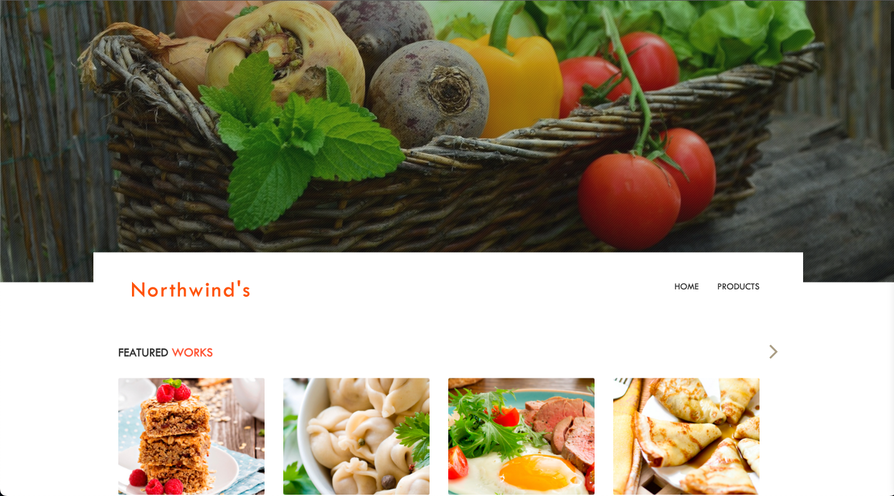
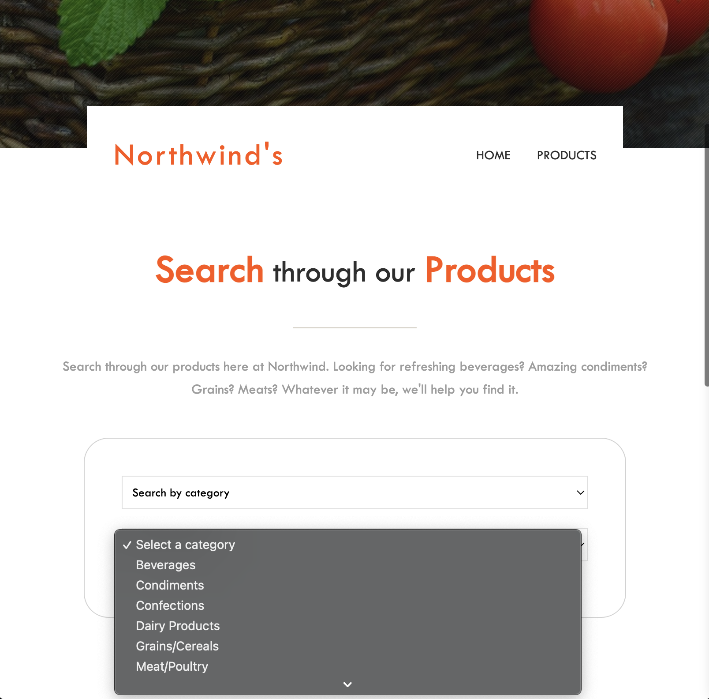
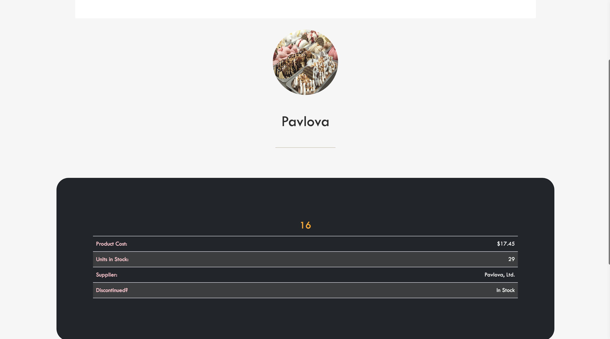

# Shop at Northwind Grocery

The Rose Project presents a grocery website using HTML, CSS, and Javascript.

Time Spent: ~28 hours 

Check it out: https://roseylikeme.github.io/northwind-grocery

<p>

</p>

## Description + Goal

I've created The Rose Project to showcase my journey and development in coding. With this particular project, my goal is to create a website that allows a user to search the food products that Northwind Grocery sells. Data for this website comes from a REST API written in Node.js that you will need to run on your local machine. 

In the Products Page, there is a dropdown with 2 options:
- Search by category
- View All

Should the user click "Search by category", another dropdown populates that lists out several categories of products Northwind sells. Otherwise, if "View All" is selected, then a list of all products will populate the page.
<p>

</p>

Once a user selects a product that is populated within a table, it will redirect the user to another page that includes more details about the product selected.
<p>

</p>

## Getting Started
1. To get the Node server running locally, you must first ensure Node.js is installed by running the following command:
```
node -v
```

2. Then, clone the following repo:
```
git clone https://github.com/DevelopIntelligenceBoulder/northwindworkshop-express-server.git
```

3. Change directory using cd into the newly cloned project's folder:
```
cd northwind-workshop-express-server
```

4. Install the project's dependencies with NPM (Node Package Manager):
```
npm install
```

5. Start the local server using the command:
```
npm start
```
6. Now that the server is running, the website will function as intended. Simply download the zip for this repo and start from the index page.

## Challenges

The most challenging part in completing this project was converting BS3 to BS5 and have my website still be responsive. There were times when my animations weren't working and I had to debug and find where my code wasn't working. 

## What I've Learned

I've learned a lot through building this grocery store website. I've further learned how to utilize API's to gather data and display it on my webpage. Also, prior to this project, I didn't really understand how to utilize Node.js, now I understand how to install and configure REST API servers and run it locally on my computer. I've also gotten better at fetching info from an API. The JS portion wasn't the most difficult thing this time.

- How to install and configure a REST API server locally.
- How to animate my webpage using CSS animation libraries such as Animate.css and WOW.js
- How to create a navbar that's not necessarily all the way on top.
